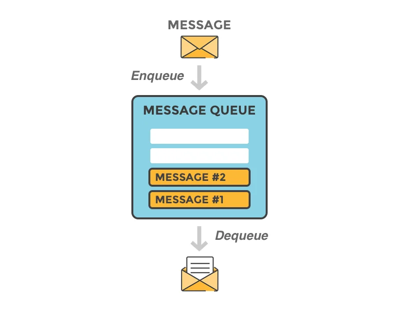

# Concept and Components

**Message queue** là một hộp thư, cho phép các thành phần/service trong một hệ thống (hoặc nhiều hệ thống), gửi thông tin cho nhau.

<figure><figcaption></figcaption></figure>

Một hệ thống sử dụng Message Queue thường có những thành phần sau đây:

* **Message**: Thông tin được gửi đi (có thể là text, binary hoặc JSON)
* **Message Queue**: Nơi chứa những message này, cho phép producer và consumer có thể trao đổi với nhau.
* **Producer**: Chương trình/service tạo ra thông tin, messgage đưa thông tin vào message queue.
* **Consumer**: Chương trình/service nhận message từ message queue và xử lý chúng.
* Một chương trình/service có thể **vừa là producer, vừa là consumer**&#x20;
* **Broker**: Trong một số trường hợp, có một thành phần trung gian (message broker) quản lý và duy trì hàng đợi. Broker có thể giúp quản lý tải, đảm bảo độ tin cậy và cung cấp các tính năng như publish-subscribe.

<figure><figcaption></figcaption></figure>

## Các loại message queue: 

#### 1. Point-to-point 

Point-to-point là khi chỉ có một hàng đợi và một consumer duy nhất dể xử lý các tin nhắn trong hàng đợi: VD: **RabbitMQ**

<figure><figcaption></figcaption></figure>

#### 2. Publisher-Subscriber 

Publisher-Subscriber (publisher - nhà sản xuất) gửi tin nhắn đến hàng đợi (gọi là Topic) và tất cả subscriber (người đăng ký) vào cùng 1 Topic đều sẽ nhận được tin nhắn trong Topic đó. VD: **RabbitMQ, Apache Kafka**

<figure><figcaption></figcaption></figure>

