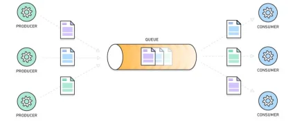

# Use in pratice

Trong các hệ thống dùng kiến trúc microservice, sử dụng message queue để giúp các service liên hệ với nhau **một cách bất đồng bộ**. _Service A_ làm xong việc có thể gửi message queue để _service B_ biết mà xử lý, **không cần phải chờ** service B làm xong.

Trong thực tế, message queue giải quyết được khá nhiều vấn đề hóc búa trong hệ thống:

* **Đảm bảo duration/recovery**: Do message đã được lưu trong queue, khi 1 service đang xử lý nhưng bị crash hoặc lỗi, ta không lo bị mất dữ liệu; vì có thể lấy message từ trong queue ra và chạy lại. Trong 1 hệ thống có nhiều consumer, nếu 1, 2 consume bị crash cũng không làm sụp toàn hệ thống
* **Phân tách hệ thống**: Giúp phân tách hệ thống thành nhiều service nhỏ hơn, mỗi service chỉ xử lý 1 chức năng nhất định.
* **Hộ trợ rate limit, batching**: Trong nhiều trường hợp, năng lực xử lý hệ thống có hạn (chỉ có thể xử lý 300 đơn hàng/s). Với message queue, ta có thể dần dần lấy đơn hàng trong queue ra xử lý, không sợ thất lạ. Hoặc thay vì mỗi lần gửi email mất thời gian lâu, ta có thể đợi message queue có yêu cầu gửi 200 email rồi gửi luôn 1 lượtc - batching.&#x20;
*   **Dễ scaling hệ thống**: Vào giờ cao điểm, nhiều truy vấn, ta có thể tăng số lượng consumer lên để xử lý được nhiều messege hơn. Khi không cần ta có thể giảm lại.

    <figure><figcaption></figcaption></figure>

    #### **Một số điểm cần lưu ý**

    * **Khó xử lý đồng bộ**: Không phải hệ thống nào cũng cần tới message queue. Nếu như service A gọi service B, theo cơ chế đồng bộ, cần kết quả xử lý ngay, ta nên dùng Rest hoặc gRPC sẽ tốt hơn.
    * **Làm hệ thống phức tạp hơn**: Thêm message queue sẽ **tăng tính phức tạp** của hệ thống.  Ta cần phải biết rõ message nào gửi vào queue nào, ai gửi ai nhận. Lúc debug ở local cũng sẽ khó khăn hơn
    * **Cần đảm bảo message format**: Để gửi/nhận, 2 phía producer và consumer phải thống nhất format với nhau. Nếu không cẩn thận lỡ 1 bên thay đổi sẽ làm bên kia không đọc được dữ liệu.
    * **Cần Monitoring Queue**: Cần có các biện phát theo dõi (monitor), để đảm bảo lượng message queue không quá nhiều, làm đầy queue. Queue tốt nhất là queue luôn rỗng, hoặc số lượng message trong queue không tăng lên (message gửi vào queue đều bị consume hết)
